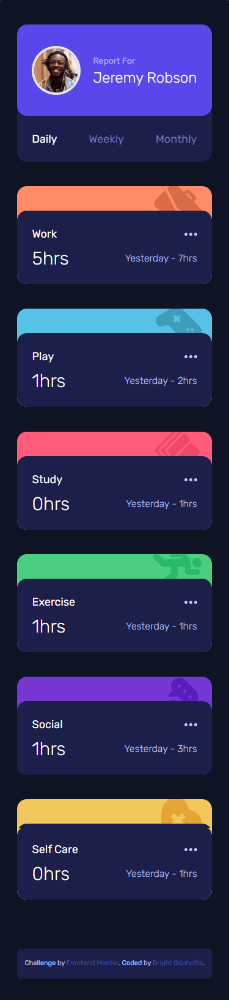

# Frontend Mentor - Time tracking dashboard solution

This is a solution to the [Time tracking dashboard challenge on Frontend Mentor](https://www.frontendmentor.io/challenges/time-tracking-dashboard-UIQ7167Jw). Frontend Mentor challenges help you improve your coding skills by building realistic projects.

## Table of contents

- [Overview](#overview)
  - [The challenge](#the-challenge)
  - [Screenshot](#screenshot)
  - [Links](#links)
- [My process](#my-process)
  - [Built with](#built-with)
  - [Continued development](#continued-development)
  - [Useful resources](#useful-resources)
- [Author](#author)

## Overview

### The challenge

Users should be able to:

- View the optimal layout for the site depending on their device's screen size
- See hover states for all interactive elements on the page
- Switch between viewing Daily, Weekly, and Monthly stats

### Screenshot

### Links

- Solution URL: [Github repo](https://github.com/Odohofre/time-tracking-dashboard)
- Live Site URL: [Live Site](https://time-tracking-dashboard-taupe.vercel.app/)

## My process

### Built with

- Semantic HTML5 markup
- CSS custom properties
- Flexbox
- CSS Grid
- Mobile-first workflow
- [React](https://reactjs.org/) - JS library
- [Tailwind CSS](https://www.tailwindcss.com/) - CSS framework

### Continued development

- Learn more about `React Hooks`.
- Learn more about `CSS-in-js` modules.
- How to use `CSS grid` better.

### Useful resources

- [NEW ReactJs docs](https://beta.reactjs.org/learn)
- [CSS-TRICKS blog on CSS Grid](https://css-tricks.com/snippets/css/complete-guide-grid/) - This is an amazing article which helped me finally understand CSS Grid. I'd recommend it to anyone still learning this concept.

## Author

- Website - [Bright Odohofre](https://odohofre.github.io)
- Frontend Mentor - [@Odohofre](https://www.frontendmentor.io/profile/Odohofre)
- Twitter - [@B_Odohofre](https://www.twitter.com/B_Odohofre)
